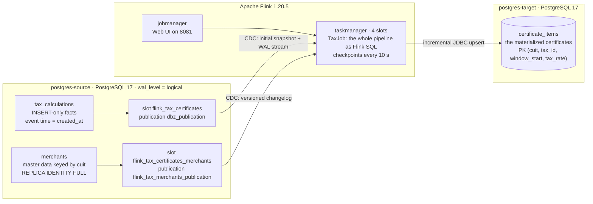
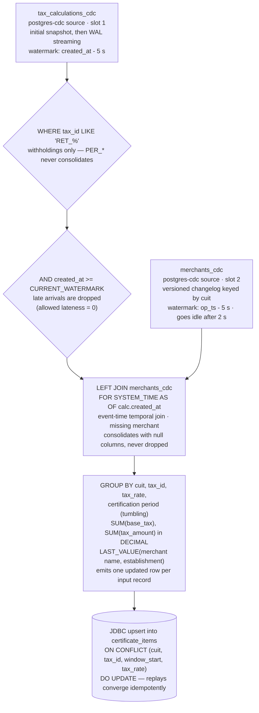

# poc-flink-taxes

An Apache Flink 1.20.5 **proof of concept for learning stream processing**: tax withholdings are consolidated into fiscal certificates by a single Flink SQL job that reads changes straight out of a PostgreSQL database (CDC over logical replication) and materializes the result, idempotently, into a second PostgreSQL database. **No Kafka anywhere** — the transport is the source database's own WAL (see [ADR-0001](docs/adr/0001-postgres-cdc-as-transport-without-kafka.md)).

The project is deliberately didactic. It re-implements on Flink the consolidation a previous Kafka Streams + MongoDB proof of concept performed with topics, Kafka Connect and a REST layer, and strips the stack down to **two databases and one job** so every moving part is small enough to inspect. The demo shows the full loop: seed data → manual inserts → certificates **growing live in plain SQL** → a certification period closing → querying closed certificates. All you need is `docker compose` and `psql`.

> Every merchant, CUIT (the Argentine taxpayer ID) and amount in this repository is fictional seed data for the demo.

## What this PoC is for

- **Change Data Capture without Kafka**: `flink-sql-connector-postgres-cdc` reading a `wal_level=logical` database directly, with an initial snapshot plus WAL streaming.
- **Event-time Flink SQL**: watermarks, an event-time temporal join, group aggregation over tumbling certification periods, and an idempotent JDBC upsert sink.
- **Streaming operations**: checkpoint failover, the savepoint → stop → restore flow, and replication-slot lifecycle (all exercised and documented).
- **A baseline for engine evaluation**: the same consolidation expressed without Kafka, so the two architectures can be compared honestly.

Domain vocabulary lives in [GLOSSARY.md](GLOSSARY.md): a **certificate** consolidates the withholdings (`RET_*` taxes) of one merchant and one tax over one **certification period**; each row of the target table is a **rate line**. Perceptions (`PER_*`) exist in the taxonomy but never consolidate — that is deliberate scope, not an omission.

## Architecture



Both databases are plain containers on one compose network; nothing else is deployed. Who creates what:

- [docker/postgres/source/init.sql](docker/postgres/source/init.sql) — the source tables, the least-privilege CDC role `flink_cdc` (REPLICATION + SELECT) and the two publications, pre-created because PostgreSQL 17 gates publication management on superuser/ownership. It also seeds 5 merchants and 24 tax calculations.
- [docker/postgres/target/init.sql](docker/postgres/target/init.sql) — the `certificate_items` table and the sink role `flink_sink` (DML on that table only).
- **Flink never issues physical DDL.** The job only *declares* its tables over the CDC and JDBC connectors; the physical target table must pre-exist (the init script above). Replication slots are created by the CDC sources at first submission and persist across job stops.

One row of `certificate_items` is a **rate line** in domain terms; the physical table name is kept deliberately — see the naming note in [docker/postgres/target/init.sql](docker/postgres/target/init.sql).

## How the Flink job works

Everything below is pure Flink SQL driven programmatically from [TaxJob](src/main/java/com/example/taxes/TaxJob.java) — no DataStream operators, no UDAFs — so the plan is inspectable in the Web UI.



Key mechanics (the `why` lives in the [TaxJob javadoc](src/main/java/com/example/taxes/TaxJob.java)):

- **Event-time temporal join.** Each withholding enriches with the merchant version as of its own `created_at` (`FOR SYSTEM_TIME AS OF`), so a certificate is a pure function of the source history and replays reproduce it. It is a LEFT join: a CUIT without a merchant row still consolidates, with null merchant columns. The `merchants` source needs `REPLICA IDENTITY FULL` so updates reach the job with their before image.
- **Live-growing certificates.** A plain group aggregation (not a window TVF) emits an updated row per input record, and the JDBC upsert sink materializes it incrementally — a certificate's rate lines grow in `certificate_items` while its certification period is still open, and stop changing once the period closes.
- **Idempotent target.** The primary key `(cuit, tax_id, window_start, tax_rate)` makes replays, retries, and crash recovery converge to the same rows instead of duplicating them — at-least-once delivery with a clean observable state, no XA.
- **Buenos Aires session zone.** The table environment pins `America/Argentina/Buenos_Aires` (fixed -03:00): calendar periods align to local midnight / first of month, and the JDBC sink converts period boundaries to UTC wall-clock instants under this pin (the detail lives in the [TaxJob javadoc](src/main/java/com/example/taxes/TaxJob.java)).
- **5-second watermark, zero lateness.** Both CDC sources carry a 5-second bounded-out-of-orderness watermark; a row arriving more than 5 seconds behind is dropped — pure-SQL Flink has no late-event recovery. The `merchants` input marks itself idle after 2 seconds (`TABLE_EXEC_SOURCE_IDLE_TIMEOUT`) so its quietness never pins the combined watermark of the join.
- **Append-only facts table.** `tax_calculations` is INSERT-only by domain definition, and its CDC table is declared *without* a primary key on purpose: declaring one would turn it into an updating source and the aggregation would silently receive nothing (documented in the javadoc).
- **10-second checkpoints.** CDC incremental snapshots commit read chunks on checkpoints, so checkpointing is non-negotiable for snapshot progress; a fixed-delay restart strategy (indefinite retries, 1 s delay) handles failures.

### One withholding, end to end

1. A row is inserted into `tax_calculations` and commits; with `wal_level=logical` and the pre-created publication, the change lands in the WAL.
2. The `tax_calculations_cdc` source captures it — on first startup via an initial snapshot (chunks commit on checkpoints), afterwards by streaming the slot.
3. Its event time is `created_at`. It is emitted only when the combined watermark of *both* inputs passes that instant (that is why a quiet stream needs one more insert — the flusher pattern).
4. The `WHERE` keeps withholdings only and drops late arrivals whose `created_at` fell below the watermark.
5. The temporal join attaches the merchant version as of `created_at` — or nulls, if none exists.
6. The group aggregation folds it into its certification period's rate line and emits an updated row.
7. The JDBC sink upserts it into `certificate_items`: the line appears, grows in place, and once `window_end < now()` the certificate is closed — finality is derived, there is deliberately no marker column — and nothing ever rewrites it.

## Getting started

Prerequisites: Docker with docker compose v2 and roughly 6 GB of free RAM for the whole stack. You do **not** need a host JDK or Gradle — builds run inside the `dev` container (JDK 17, Gradle 8.14.3 pinned in [.devcontainer/Dockerfile](.devcontainer/Dockerfile); there is no wrapper in the repo).

Either open the repository in VS Code and run **Dev Containers: Reopen in Container**, or just:

```bash
docker compose up -d
```

| Service | Purpose | Host port |
| --- | --- | --- |
| `dev` | build/dev container (Java 17, Gradle 8.14.3) | — |
| `test-runner` | one-off Gradle runner with Docker access (e2e tests) | — |
| `jobmanager` | Flink JobManager | 8081 (Web UI) |
| `taskmanager` | Flink TaskManager, 4 slots | — |
| `postgres-source` | source DB, `wal_level=logical` | 5432 |
| `postgres-target` | target DB, materialized result | 5433 |

> **Host port note.** All published ports bind to loopback only (`127.0.0.1`) — the Flink REST/UI allows JAR upload and the databases should not be reachable from the network; `curl localhost:8081` and host-side `psql` still work. If another service on your machine already holds port 5432, `docker compose up` fails to start `postgres-source` with a `port is already allocated` bind error. Stop the conflicting service or remove the host mapping — the demo does not need it: every database access below goes through `docker compose exec ... psql`, which works from host and devcontainer regardless of host port bindings (see the note in the [runbook](docs/savepoint-restore-exercise.md)).

## Demo walkthrough

Copy-paste your way through. Keep two terminals: one for the job, one for `psql`.

### 1. Reset to a clean state

```bash
docker compose down -v && docker compose up -d
docker compose ps   # wait until both Postgres services are healthy; the Flink containers have no healthcheck — "running" is enough
```

If the `flink-checkpoints` volume was just created, make it writable by the Flink user once:

```bash
docker compose exec jobmanager chown flink:flink /opt/flink/checkpoints
```

### 2. Verify the seed

The source starts with 5 merchants and 24 tax calculations (a backfill spanning ~26 hours ago to seconds ago, both tax families, several rates, and one CUIT deliberately without a merchant). The target starts empty:

```bash
docker compose exec postgres-source psql -U flink -d taxes -c 'SELECT count(*) FROM merchants;'             # 5
docker compose exec postgres-source psql -U flink -d taxes -c 'SELECT count(*) FROM tax_calculations;'      # 24
docker compose exec postgres-target psql -U flink -d taxes -c 'SELECT count(*) FROM certificate_items;'     # 0
```

### 3. Build the fat JAR

```bash
docker compose run --no-deps --rm dev bash -lc 'cd /workspace && gradle --no-daemon shadowJar'
```

- The `cd /workspace` is required: the one-off container starts in `/`, not in the mounted repo.
- `build/libs` is bind-mounted into the JobManager at `/opt/flink/usrlib`, so no copy is needed.
- After a `gradle clean`, recreate the Flink containers so the mount picks up the new build directory: `docker compose up -d --force-recreate jobmanager taskmanager`.

### 4. Submit the job

```bash
docker compose exec jobmanager flink run -c com.example.taxes.TaxJob /opt/flink/usrlib/poc-flink-taxes-0.1.0-all.jar
```

No env config needed: the defaults resolve the compose service names and their in-network ports (`TARGET_POSTGRES_PORT` exists for other deployments). The client stays attached — Ctrl+C is safe, the job keeps running on the cluster — so run this in a separate terminal or background it.

### 5. Wait for the snapshot, then watch checkpoints and slots

The CDC source first reads the existing rows (snapshot scan), then switches to streaming. Give it 30–60 s. Watch completed checkpoints climb by one every 10 seconds:

```bash
curl -s http://localhost:8081/jobs/<jobId>/checkpoints | python3 -m json.tool | grep -A8 counts
```

`<jobId>` is printed by the submit command (`Job has been submitted with JobID <jobId>`) and listed by `curl -s http://localhost:8081/jobs`. The Web UI at [http://localhost:8081](http://localhost:8081) shows the job graph, the SQL plan, checkpoint history and exception traces; `flink list` (inside the jobmanager container) and `/jobs/<jobId>/exceptions` are the quickest diagnostic routes.

And both replication slots active on the source:

```bash
docker compose exec postgres-source psql -U flink -d taxes -c 'SELECT slot_name, active FROM pg_replication_slots;'
```

### 6. Insert labeled rows and watch a rate line appear and grow

Insert rows **after** the job is already streaming (CUIT `30123456781` has merchant master data — Supermercados del Plata S.A. — so this also exercises the temporal join). Tip: start when the wall clock is a few seconds past a minute so the rows share one 60-second period; crossing a period boundary is also fine, it just opens another rate line.

```bash
# 1) A RET_IVA withholding:
docker compose exec postgres-source psql -U flink -d taxes -c "
INSERT INTO tax_calculations (cuit, tax_id, tax_rate, base_tax, tax_amount, tax_status, created_at)
VALUES ('30123456781', 'RET_IVA', 3.50, 1234.56, 43.21, 'ACTIVE', now());"
```

Poll the target (you will reuse this query after every insert):

```bash
docker compose exec postgres-target psql -U flink -d taxes -c \
  "SELECT tax_id, window_start, window_end, total_base_tax, total_tax_amount, merchant_name, establishment
   FROM certificate_items WHERE cuit = '30123456781' ORDER BY window_start, tax_id;"
```

Nothing new appears yet — **emission needs a later event**: the watermark only advances when new rows arrive, so this row waits for the next insert.

```bash
# 2) A second RET_IVA withholding, ~20 s later — its event time pushes the watermark past row 1:
docker compose exec postgres-source psql -U flink -d taxes -c "
INSERT INTO tax_calculations (cuit, tax_id, tax_rate, base_tax, tax_amount, tax_status, created_at)
VALUES ('30123456781', 'RET_IVA', 3.50, 2222.22, 77.78, 'ACTIVE', now());"
```

Poll again (verified): the RET_IVA rate line is there — `total_base_tax = 1234.56`, `merchant_name = Supermercados del Plata S.A.`, `establishment = 10001` — and its `window_end` is still in the future: the period is **open**.

```bash
# 3) A RET_GANANCIAS withholding, ~25 s later — pushes the watermark past row 2:
docker compose exec postgres-source psql -U flink -d taxes -c "
INSERT INTO tax_calculations (cuit, tax_id, tax_rate, base_tax, tax_amount, tax_status, created_at)
VALUES ('30123456781', 'RET_GANANCIAS', 2.00, 999.99, 20.00, 'ACTIVE', now());"
```

Poll again (verified): the RET_IVA line **upserted in place** — same `window_start`, now `total_base_tax = 3456.78` (1234.56 + 2222.22) and `total_tax_amount = 120.99`. The GANANCIAS row is not visible yet; it waits for a later event.

```bash
# 4) A flusher row, ~30 s later — pushes the watermark past row 3:
docker compose exec postgres-source psql -U flink -d taxes -c "
INSERT INTO tax_calculations (cuit, tax_id, tax_rate, base_tax, tax_amount, tax_status, created_at)
VALUES ('30123456781', 'RET_IVA', 3.50, 555.55, 19.44, 'ACTIVE', now());"
```

Poll one more time (verified): `RET_GANANCIAS` appears with `total_base_tax = 999.99`, `total_tax_amount = 20.00`, and the RET_IVA line is unchanged — while the flusher row itself has **no** line yet: it is the newest event, so it stays in the still-open period until the next insert.

### 7. What you just watched: a certificate growing live

Each insert pushed the watermark past all earlier rows, and each earlier row then consolidated. The group aggregation emits an updated row per input record and the JDBC upsert sink materializes it incrementally, so the RET_IVA rate line first **appeared** (`1234.56`) and then **grew in place** (`3456.78`) under the same primary key `(cuit, tax_id, window_start, tax_rate)` — while its certification period was still open. Rate lines stop changing once their period closes; the newest row always lags one insert behind (the flusher mechanic, inherent to event time).

### 8. Query closed certificates

The default certification period is 60 seconds, so a period's `window_end` passes ~1 minute after its start. A certificate is closed when `window_end < now()` — derived, deliberately no marker column:

```bash
docker compose exec postgres-target psql -U flink -d taxes -c \
  "SELECT cuit, tax_id, tax_rate, window_start, window_end, total_base_tax, total_tax_amount
   FROM certificate_items WHERE window_end < now() ORDER BY window_start, tax_id;"
```

You will see your two demo rate lines among the closed rows (plus whatever the backfill produced). If one of your inserts crossed a period boundary it opened its own rate line — a different `window_start`, same rules.

### 9. Honest caveats

- **Seed-backfill rate lines may be partial or absent.** The CDC snapshot's delivery order is scrambled, allowed lateness is 0, and old rows can therefore be dropped (documented in [docker/postgres/source/init.sql](docker/postgres/source/init.sql)). The count is nondeterministic: two verified runs produced 13 and 9 rate lines from the same 24 seeded calculations. The deterministic part of the demo is the live inserts of steps 6–8.
- **Backfill rate lines carry NULL merchant columns.** The temporal join enriches *as of* each calculation's `created_at`, and merchant versions exist only from the job's first snapshot on — every seeded calculation predates that snapshot, so it finds no version and consolidates unenriched. Live inserts see the snapshot version and enrich (Supermercados del Plata S.A. above).
- **The newest period always stays open** until the next insert — that is the flusher pattern, inherent to event time, not a bug.
- **`PER_*` perceptions never consolidate** (by design; only the `RET_*` withholding family does).

## Configuration

### Certification period

Sized by the `--certification-period` submission flag or the `CERTIFICATION_PERIOD` env var, defaulting to `60s`:

- `<n>s` — tumbling period of `n` seconds for any `n >= 1` (e.g. `60s`, `1s`). Boundaries are multiples of `n` on the Buenos Aires wall clock, counted from local midnight; for sizes that divide the 3-hour zone offset — including the 60 s default — those boundaries are also plain epoch multiples, which is why the demo's rows share periods the intuitive way.
- `daily` — one calendar day, aligned to Buenos Aires midnight.
- `monthly` — one calendar month, aligned to the first of the Buenos Aires month.

Example submission for daily certificates:

```bash
docker compose exec jobmanager flink run -c com.example.taxes.TaxJob /opt/flink/usrlib/poc-flink-taxes-0.1.0-all.jar --certification-period daily
```

### Database credentials

Two sets of credentials exist, both with password `flink` against database `taxes`:

- **Admin/bootstrap** — user `flink`, the compose `POSTGRES_USER` superuser. It serves the container healthchecks and every `docker compose exec ... psql -U flink ...` example in this README (ops and verification access).
- **Pipeline roles** — the job authenticates as `flink_cdc` on the source (REPLICATION + SELECT; see [docker/postgres/source/init.sql](docker/postgres/source/init.sql)) and as `flink_sink` on the target (SELECT/INSERT/UPDATE/DELETE on `certificate_items`; see [docker/postgres/target/init.sql](docker/postgres/target/init.sql)). The CDC publications on the source are pre-created by the admin role in the init script, because PostgreSQL gates publication management on superuser/table ownership.

Both roles are created by the init scripts, which run only when the data directory is empty. On an already-initialized volume, run `docker compose down -v && docker compose up -d` once so the roles exist.

### Environment variables

All resolved in [PipelineConfig](src/main/java/com/example/taxes/PipelineConfig.java); the defaults fit the compose cluster, so a plain `flink run` needs none of them:

| Variable | Default | Meaning |
| --- | --- | --- |
| `SOURCE_POSTGRES_HOST` / `SOURCE_POSTGRES_PORT` | `postgres-source` / `5432` | source connection |
| `TARGET_POSTGRES_HOST` / `TARGET_POSTGRES_PORT` | `postgres-target` / `5432` | target connection (in-network port; `5433` is only the host mapping) |
| `SOURCE_POSTGRES_USER` / `TARGET_POSTGRES_USER` | `flink_cdc` / `flink_sink` | pipeline DB roles (least privilege; see the credentials note above) |
| `POSTGRES_DB` / `POSTGRES_PASSWORD` | `taxes` / `flink` | database name and password shared by both connections |
| `CDC_SLOT_NAME` | `flink_tax_certificates` | tax source slot; the merchants slot is derived as `<name>_merchants` |
| `CERTIFICATION_PERIOD` | `60s` | period spec (same forms as the flag) |

## Operations

- **Checkpoints and automatic failover.** The job checkpoints every 10 seconds against the `flink-checkpoints` volume and restarts with a fixed-delay strategy: a failing job restores from its last completed checkpoint and keeps its stream position. **Crash recovery is proven automatically** by `CheckpointRecoveryE2eTest`, which kills the target database mid-run and asserts convergence without duplicates or gaps.
- **Planned stops and upgrades** (new JAR, changed configuration) use the savepoint → stop → restore flow. The runbook with exact commands and real observed outputs — including the proof that the CDC snapshot is not re-run — lives in [docs/savepoint-restore-exercise.md](docs/savepoint-restore-exercise.md). Restore with the *same* connection settings: JDBC URLs are baked into the job graph at submission time, not read back from the savepoint.
- **Replication slot lifecycle gotcha.** The two slots persist across stop/restore and even `flink cancel` (inactive but present), which is what lets a restored job resume the WAL. Dropping a slot discards the stream position and forces a full re-snapshot on the next submission; never drop a slot that is still `active`.
- **Diagnostics.** Web UI at [http://localhost:8081](http://localhost:8081) (job graph, SQL plan, checkpoints, exceptions), `curl -s http://localhost:8081/jobs/<jobId>/exceptions`, or `docker compose exec jobmanager flink list` / `flink cancel <jobId>`.

## Tests

```bash
docker compose run --rm test-runner bash -lc 'cd /workspace && gradle --no-daemon test'
```

`test-runner` uses host networking plus the mounted Docker socket; the e2e tests spin up their own ephemeral PostgreSQL containers via Testcontainers against the repo's init scripts and run the job on an in-process Flink mini-cluster. Two environment notes: Testcontainers needs a recent Docker Engine (the repo pins `api.version=1.44`, i.e. Engine ≥ 25 — see [src/test/resources/docker-java.properties](src/test/resources/docker-java.properties)), and if your host docker group GID differs from the compose default, export `DOCKER_SOCKET_GID` accordingly (`getent group docker | cut -d: -f3`).

Unit tests cover the period-spec parser (`CertificationPeriodTest`) and the submission-flag grammar (`TaxJobTest`). The six e2e suites:

| Suite | Proves |
| --- | --- |
| `CertificateConsolidationE2eTest` | withholdings consolidate into rate lines correctly |
| `MerchantEnrichmentE2eTest` | the event-time temporal join enriches (and survives merchantless CUITs) |
| `MerchantDeleteE2eTest` | a merchant deleted after a period closes never rewrites the closed certificate |
| `CertificationPeriodE2eTest` | period sizing, timezone alignment, and late-row dropping |
| `CheckpointRecoveryE2eTest` | failover from checkpoints converges without duplicates or gaps |
| `RestartFromScratchE2eTest` | a fresh job on a new slot re-snapshots and converges to exactly the same certificate rows |

## Scope and deliberate limitations

This is a learning PoC, and several constraints are accepted explicitly rather than hidden:

- **Late events are dropped, never recovered** (allowed lateness 0 — a pure-SQL limitation), which also makes the seeded backfill nondeterministic (see caveat 9).
- **At-least-once + idempotent upsert**, not exactly-once XA.
- **Perceptions (`PER_*`) do not consolidate**; `tax_status` and `exclusion_rate` ride along in the schema but no logic uses them.
- **One job, one compose runtime**: no Kubernetes, no remote clusters, no CI — the e2e suite (which needs Docker) is the safety net.
- Container memory/pids limits are **PoC guard rails, not production sizing**, and state retention/TTL is not tuned for long-lived production jobs.

## Repository map

- [GLOSSARY.md](GLOSSARY.md) — domain vocabulary (merchant, withholding, rate line, certification period).
- [docs/adr/0001-postgres-cdc-as-transport-without-kafka.md](docs/adr/0001-postgres-cdc-as-transport-without-kafka.md) — why no Kafka.
- [docs/savepoint-restore-exercise.md](docs/savepoint-restore-exercise.md) — verified savepoint/stop/restore runbook.
- [sql/source.sql](sql/source.sql) — helper queries for the source DB (e.g. inspecting replication slots).
- [src/main/java/com/example/taxes/TaxJob.java](src/main/java/com/example/taxes/TaxJob.java) — the whole pipeline as Flink SQL; javadoc carries the why.
- [src/main/java/com/example/taxes/PipelineConfig.java](src/main/java/com/example/taxes/PipelineConfig.java), [CertificationPeriod.java](src/main/java/com/example/taxes/CertificationPeriod.java) — configuration and period spec.
- [docker/postgres/source/init.sql](docker/postgres/source/init.sql) / [docker/postgres/target/init.sql](docker/postgres/target/init.sql) — schemas, roles and seed data.
- [docker-compose.yml](docker-compose.yml) — the whole runtime; comments explain each guard rail.

## Troubleshooting

- **Job fails instantly with `Failed to create directory for shared state`** — the checkpoints volume is owned by root. One-time fix: `docker compose exec jobmanager chown flink:flink /opt/flink/checkpoints`.
- **Job stuck in `RESTARTING` with `unable to open JDBC writer` → `Connection to postgres-target:5433 refused`** — the submission used the host mapping `5433` as `TARGET_POSTGRES_PORT`. The in-network port is `5432` (the default); cancel and resubmit without the override.
- **New submission claims the replication slot is in use** after an unclean stop — the old connection still holds it. Check `SELECT slot_name, active FROM pg_replication_slots;`, wait for it to go inactive (or restart `postgres-source`); never drop an active slot.
- **Rows inserted but nothing consolidates** — the flusher pattern (step 6 of the walkthrough): the newest period stays open until a later event pushes the watermark.
- **Testcontainers cannot reach the Docker daemon** in `dev`/`test-runner` — the mounted socket's group GID does not match. Export `DOCKER_SOCKET_GID` with your host's docker GID (`getent group docker | cut -d: -f3`) and recreate the containers.
- **`ClassNotFoundException` / stale jar after `gradle clean`** — recreate the Flink containers: `docker compose up -d --force-recreate jobmanager taskmanager`.

The fuller list, with real observed outputs, is in the [runbook's troubleshooting section](docs/savepoint-restore-exercise.md).
